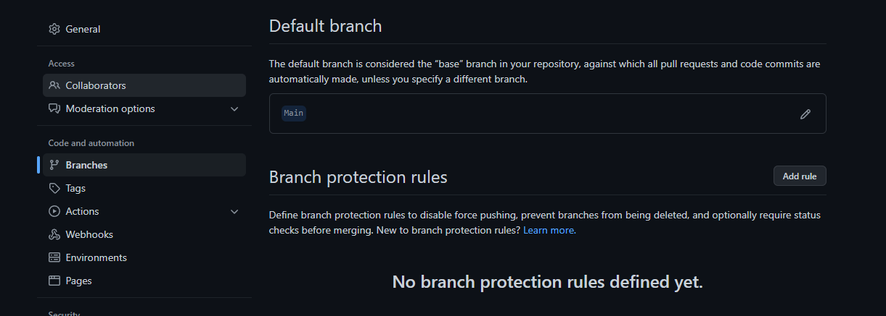
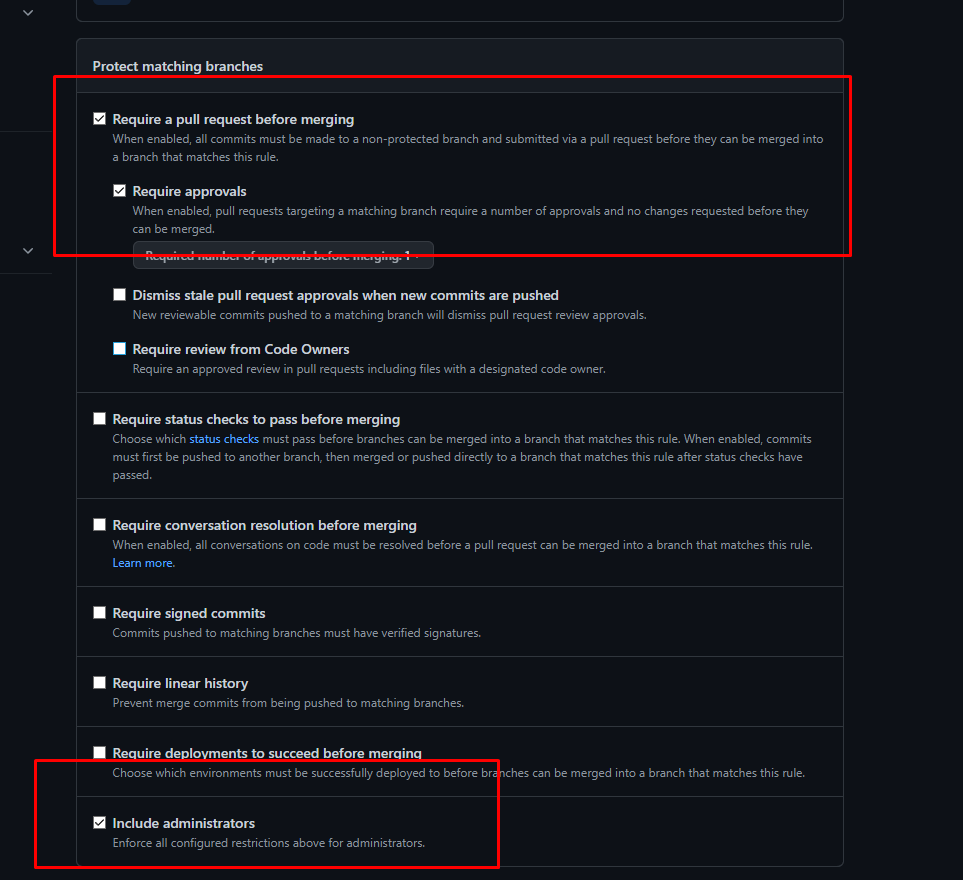

1) I opened git bash and used # git clone https://github.com/instana/robot-shop.git to fork the project to my desktop  

2) I used # ls -Al | grep ^d | wc -l Command the A flag is to see also the hidden folders.  the outcome was 17 

3) I used # find . -mindepth 1 -type d | wc -l  to see all the directories total in the repository I used mindpath 1 to not include the repository 

I used # find . -type f | wc -l to count all the files in the entire repo

4) I created a repository and named it: “Cycode_Exam” on GitHub and pushed robot-shop with the following procedure
I check with #pwd that I’m in the correct directory (robot-shop)
Then I used the following procedure to push robot-shop to GitHub:

$ git init 
$ git add . 
$ git commit -m "first commit" 
$ git branch -M Main 
$ git remote add origin https://github.com/Shimon1999/Exam_Cycode.git 
$ git push -u origin Main 

5) I created 3.key and 4.key files with the vi command

6) To push the change, I used the following procedure: 

First, I created a new branch named Shimon

$ git add 3.key 4.key 
$ git commit -m "1 change" 
$ git branch -M Shimon 
$ git push -u origin Shimon 

7) I pushed the change to Shimon repository and then pulled and merged the change to Main repo

8) I followed the instructions and run the microservice at the following way:

$ docker-compose pull 
$ docker-compose up 

9) To attach the images to the output.md file i uploaded a folder with screenshots to Shimon branch and used the following format to add theam: !{}(images/image_name)

10) There is a problem committing files directly into the Master/Main branch, it can impact our project/service and make it unavailable or unfunctional. 
We can prevent it by making a secondary branch and seeing how the changes affect the project. 
Moreover, we can make changes at the repository settings and make sure that only the creator/admin can push changes in the Main repository.

A. we will go to settings and chose branches, then we will add a new rule:

B. Then we will set the following permissions on the rule:

Add signature and fun logo:
